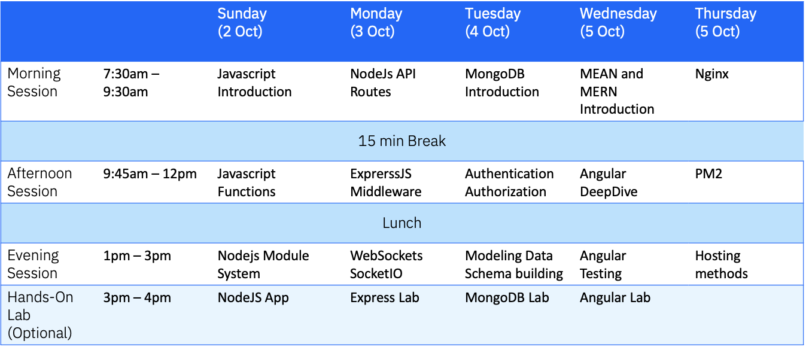
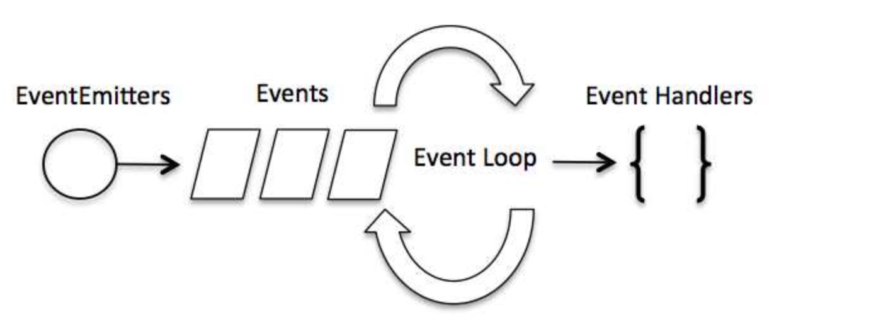
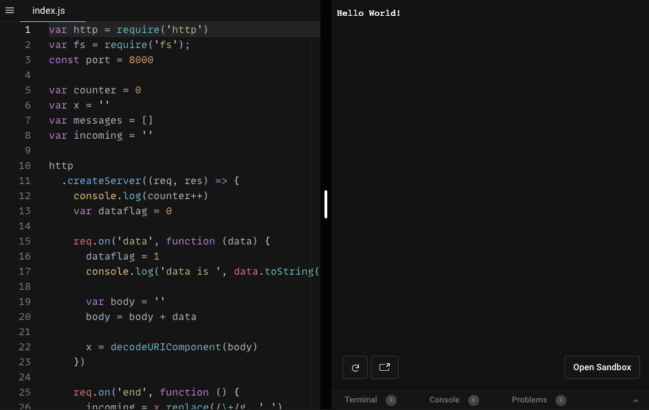

id: 02-node-js
summary: Summary of lab
categories: NodeJs, JavaScript
status: Published
authors: Hakam Abdelqader
Feedback Link: mailto:hakam.abdelqader@ibm.com
environments: Web, polymer-summit

# Introduction to NodeJS 
Background / Summary of the Labs.

<!-- ------------------------ -->
## Introduction 
Duration: 00:02:00

Background / Summary of the Labs.

### What you'll build
In this session, you'll build a pure NodeJS chatbot. 
The completed app will allow a user to put in the name and join into a group chat.
You'll build everything with NodeJs using the native HTTP module.
This is the app you'll be building today

### Concepts we will cover
- JavaScript Overview
- JavaScript Object-Oriented Programming
- JavaScript Scope
- NodeJS
  
<!-- ------------------------ -->
## Agenda 
Duration: 00:01:00

### Weeks agenda 




# Codelab: Introduction to NodeJS

This codelab will go through the process of creating a simple NodeJS application. We will learn how to initialize a new NodeJS project, install packages, send requests and handle events

If at any point during this tutorial you're lost or your code is not working, you can check the final files listed in this repository.

<!-- ------------------------ -->
## Node.js Global variables __filename

Node.js global objects are global in nature and they are available in all modules. We do not need to include these objects in our application, rather we can use them directly. These objects are modules, functions, strings and object itself as explained below.
### __filename
The_filename represents the filename of the code being executed. This is the resolved absolute path of this code file. For a main program this is not necessarily the same filename used in the command line. The value inside a module is the path to that module file.

### Example
Create a js file named main.js which has the following code:

```js
// Let's try to print the value of
filename
console.log(__filename);

```
Now run the main.js to see the result:

```bash
$ node main.js
```
Based on the location of your program, it will print main file name as follows:

```text
/web/com/1427091028_21099/main.js
```

## Node.js Global variables __dirname

### __dirname

The _dirname represents the name of the directory that the currently executing script resides in.

### Example
Create a js file named main.js which has the following code:

```js
// Let's try to print the value of _dirname
console.log(_dirname);
```
Now run the main.js to see the result:

```bash
$ node main.js
```

Based on the location of your program, it will print current directory name as follows:

```text
/web/com/1427091028_21099
```


<!-- ------------------------ -->
## Using the `fs` Module

In Node Application, any async function accepts a callback as a last parameter and the callback function accepts error as a first parameter. Let's revisit the previous example again. Create a text file named input.txt having following content

```text
We are here at Aramco learrning NodeJS and building our chatbots !!!!!
```
Create a js file named main.js having the following code:

```js
var_fs = require("fs");
fs.readFile('input.txt', function(err, data) { 
    if (err) {
        console.log(err.stack); 
        return;
    }
    console.log(data.toString() ); 
});
console.log("Program Ended");
```

Finally prints the content.

```text
Program Ended 
We are here at Aramco learrning NodeJS and building our chatbots !!!!!
```

<!-- ------------------------ -->

## Node.js Streams

### What are Streams?

Streams are objects that let you read data from a source or write data to a destination in continous fashion. In Node.js, there are four types of streams.

Positive
: 1. Readable - Stream which is used for read operation.
  2. Writable - Stream which is used for write operation.    
  3.  Duplex - Stream which can be used for both read and write operation. 
  4. Transform - A type of duplex stream where the output is computed based on input.

### Types of Streams

Each type of Stream is an EventEmitter instance and throws several events at different instance of times. For example, some of the commonly used events are:

> 1. data - This event is fired when there is data is available to read.  
> 2. end - This event is fired when there is no more data to read.
> 3. error - This event is fired when there is any error receiving or writing data.  
> 4. finish - This event is fired when all data has been flushed to underlying system


This tutorial will give you understanding on commonly used operations on Streams.

<!-- ------------------------ -->
## Reading from stream

Create a text file named `input.txt` having following content:

```text
We are here at Aramco learrning NodeJS and building our chatbots !!!!!
```
Create a js file named main.js which has the following code:

```js
var fs = require("fs");
var data = "";
// Create a readable stream 
var readerStream = fs.createReadStream('input.txt');

// Set the encoding to be utf8. 
readerStream.setEncoding('UTF8');

// Handle stream events --> data, end, and error 
readerStream.on('data', function (chunk) {
  data += chunk;
});
readerStream.on('end', function () {
  console.log(data);
});
readerStream.on('error', function (err) {
  console.log(err.stack);
});

console.log("Program Ended");
```

Now run the main.js to see the result:

```
$ node main.js

```
### Verify the Output

```text
Program Ended
We are here at Aramco learrning NodeJS and building our chatbots !!!!!
``` 
<!-- ------------------------ -->
## Writing to stream
Create a js file named main.js which has the following code:

```js
var fs = require("fs");
var data = "Learning is Easy";

// Create a writable stream
var writerStream = fs.createWriteStream("output.txt");

// Write the data to stream with encoding to be utf8
writerStream.write(data, "UTF8");

// Mark the end of file
writerStream.end();
// Handle stream events --> finish, and error
writerStream.on("finish", function () {
  console.log("Write completed.");
});
writerStream.on("error", function (err) {
  console.log(err.stack);
});
console.log("Program Ended");
```

Now run the main.js to see the result:

```bash
$ node main.js
```

Verify the Output

```text
Program Ended 
Write completed.
```

Now open output.txt created in your current directory and verify the following content available in output.txt file.

```text
Simply Easy Learning
```

<!-- ------------------------ -->
## Pipeing Streams
Piping is a mechanism where we provide output of one stream as the input to another stream. It is normally used to get data from one stream and to pass output of that stream to another stream. There is no limit on piping operations. Now we'll show a piping example for reading from one file and writing it to another file.

Create a js file named main.js which has the following code:

```js
var fs = require("fs");

// Create a readable stream 
var readerStream = fs.createReadStream('input.txt');

// Create a writable stream 
var writerStream = fs.createWriteStream('output.txt');
// Pipe the read and write operations 

// read input.txt and write data to output.txt 
readerStream.pipe(writerStream);
console.log("Program Ended");
```

Now run the main.js to see the result:

```text
$ node main.js
```

### Verify the Output

```text
Program Ended
```
Open output.txt created in your current directory and verify the following content available in output.txt file.

```text
We are here at Aramco learrning NodeJS and building our chatbots !!!!!
```

<!-- ------------------------ -->
## Node.js - Event Loop

Node js is a single threaded application but it support concurrency via concept of event and callbacks. As every API of Node js are asynchronous and being a single thread, it uses async function calls to maintain the concurrency. Node uses observer pattern. Node thread keeps an event loop and whenever any task get completed, it fires the corresponding event which signals the event listener function to get executed.
Event Driven Programming
Node.js uses events heavily and it is also one of the reasons why Node.js is pretty fast compared to other similar technologies. As soon as Node starts its server, it simply initiates its variables, delcares functions and then simply waits for event to occur.
In an event-driven application, there is generally a main loop that listens for events, and then triggers a callback function when one of those events is detected.



While Events seems similar to what callbacks are. The difference lies in the fact that callback functions are called when an asynchronous function returns its result where as event handling works on the observer pattern. The functions which listens to events acts as Observers. Whenever an event gets fired, its listener function starts executing. Node.js has multiple in-built events available through events module and EventEmitter class which is used to bind events and event listeners as follows:

```js
// Import events module 
var events = require('events'); 
// Create an eventEmitter object 
var eventEmitter = new events. EventEmitter();
```

Following is the syntax to bind event handler with an event:

```js
// Bind event and even handler as follows 
eventEmitter.on('eventName', eventHandler);
```

We can fire an event programatically as follows:

```js
// Fire an event 
eventEmitter.emit('eventName');
```
<!-- ------------------------ -->
## Event Loop Example

Create a js file named main.js having the following code:

```js
// Import events module 
var events = require('events'); 

// Create an eventEmitter object 
var eventEmitter = new events. EventEmitter();

// Create an event handler as follows 
var connectHandler = function connected () {
    console.log('connection succesful.');
    
    // Fire the data_received event 
    eventEmitter.emit('data_received');
}

// Bind the connection event with the handler 
eventEmitter.on('connection', connectHandler);

// Bind the data received event with the anonymous function 
eventEmitter.on('data_received', function () {
    console.log('data received succesfully.');
});

// Fire the connection event 
eventEmitter.emit('connection');

console.log("Program Ended.");
```

Now let's try to run the above program as check the output:

```bash
$ node main.js
```
This will produce following result:

```
connection succesful. 
data received succesfully. 
Program Ended.
```

<!-- ------------------------ -->
## Node.js - Event Emitter
Many objects in Node emit events for example a net.Server emits an event each time a peer connects to it, a fs.readStream emits an event when the file is opened. All objects which emit events are instances of events.EventEmitter.

### EventEmitter Class
As we have seen in previous section, EventEmitter class lies in events module. It is accessibly via following syntax:

```js
// Import events module 
var events = require('events'); 

// Create an eventEmitter object 
var eventEmitter = new events. EventEmitter();
```

When an EventEmitter instance faces any error, it emits an 'error' event. When new listener is added, 'newListener' event is fired and when a listener is removed, 'removeListener' event is fired.

EventEmitter provides multiple properties like on and emit. on property is used to bind a function with the event and emit is used to fire an event.

### Methods


- **addListener(event, listener)** Adds a listener to the end of the listeners array for the specified event. No checks are made to see if the listener has already been added. Multiple calls passing the same combination of event and listener will result in the listener being added multiple times. Returns emitter, so calls can be chained. 
- **on(event, listener)** Adds a listener to the end of the listeners array for the specified event. No checks are made to see if the listener has already been added. Multiple calls passing the same combination of event and listener will result in the listener being added multiple times. Returns emitter, so calls can be chained. 
- **emit(event, [arg1], [arg2], [...])** Execute each of the listeners in order with the supplied arguments. Returns true if event had listeners, false otherwise.
- **once(event, listener)** Adds a one time listener for the event. This listener is invoked only the next time the event is fired, after which it is removed. Returns emitter, so calls can be chained. 
- **removeListener(event, listener)** Remove a listener from the listener array for the specified event. Caution: changes array indices in the listener array behind the listener. removeListener will remove, at most, one instance of a listener from the listener array. If any single listener has been added multiple times to the listener array for the specified event, then removeListener must be called multiple times to remove each instance. Returns emitter, so calls can be chained. 
- **removeAllListeners([event])** Removes all listeners, or those of the specified event. It's not a good idea to remove listeners that were added elsewhere in the code, especially when it's on an emitter that you didn't create (e.g. sockets or file streams). Returns emitter, so calls can be chained. 
- **setMaxListeners(n)** By default EventEmitters will print a warning if more than 10 listeners are added for a particular event. This is a useful default which helps finding memory leaks. Obviously not all Emitters should be limited to 10. This function allows that to be increased. Set to zero for unlimited.  
- **listeners(event)** Returns an array of listeners for the specified event.


### Class Methods
- **listenerCount(emitter, event)** Return the number of listeners for a given event.
- **newListener event -** String The event name listener - Function The event handler function This 1. event is emitted any time a listener is added. When this event is triggered, the listener may not
yet have been added to the array of listeners for the event.
- **removeListener event -** String The event name listener - Function The event handler function This 2 event is emitted any time someone removes a listener. When this event is triggered, the listener
may not yet have been removed from the array of listeners for the event.


:<!-- ------------------------ -->
## Event Emitter Example

Create a js file named main.js with the following Node.js code:

```js

var events = require('events'); 
var { EventEmitter } = require('events'); 
var eventEmitter = new events.EventEmitter();

// listener #1 
var user1 = function user1() {
console.log('User 1 created');
}

// listener #2 
var user2 = function user2() {
console.log('User 2 created.'); 
}
// Bind the connection event with the user1 function
 eventEmitter.addListener('connection', user1);

// Bind the connection event with the user2 function
 eventEmitter.on('connection', user2);

var eventListeners = EventEmitter.listenerCount(eventEmitter, 'connection');
console.log(eventListeners + " Listner(s) listening to connection event");

// Fire the connection event 
eventEmitter.emit('connection');

// Remove the binding of user1 function eventEmitter. removeListener('connection', user1); 
console.log("User1 will not listen now.");

// Fire the connection event 
eventEmitter.emit('connection');

eventListeners =  EventEmitter.listenerCount(eventEmitter, 'connection');
console.log(eventListeners + " Listner(s) listening to connection event");


console.log("Program Ended.");
```

Now run the main.js to see the result:
```
$ node main.js
```

<!-- ------------------------ -->
## Chatbot Pure NodeJs Example

Run the code the code on your system and give it a try:



<!-- ------------------------ -->
## Congratulations!

You have successfully have the knowledge to handle events deal with file systems in NodeJS application using  FS (file system)!

