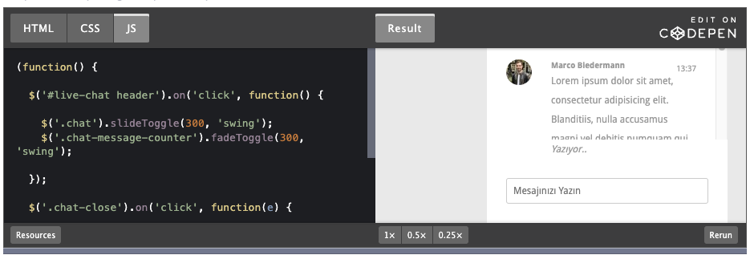

id: express-codepen
summary: Summary
categories: day-3
tags: nodeJs, Server, Client, Javascript, expressjs, websocket, angular, react, testing
status: Published
authors: Hakam Abdelqader
Feedback Link: mailto:hakam.abdelqader@ibm.com

# Title


<!-- ------------------------ -->
## 1. Setting up your Express.jS application
Duration: 00:05:00

### Basic initiation of the project
To begin creating the application, type the following lines into your terminal.

```
$ mkdir myapp
$ cd myapp
$ npm init
$ npm install express --save
```

### Hellow world Express application
Add the following code to an app.js file in the myapp directory. Now we have a Node.js application running with the express framework thanks to this simple configuration.

```
const express = require('express')
const app = express()
const port = 3000

app.get('/', (req, res) => {res.send('Hello World!')
})
app.listen(port, () => {console.log(`Example app listening at http://localhost:${port}`)
```

