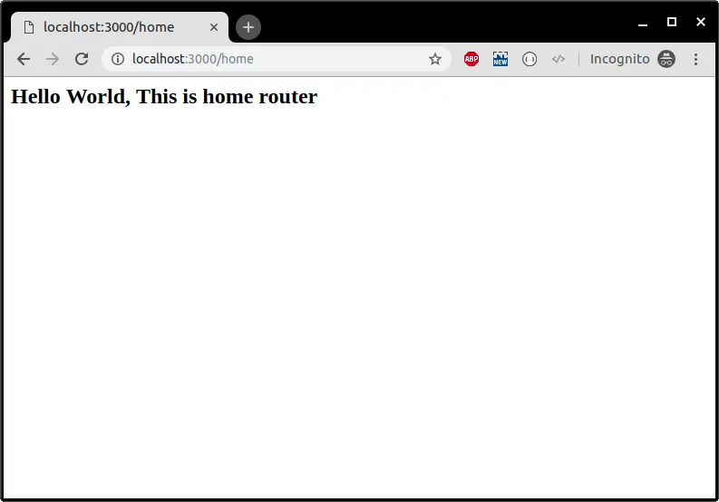

id: 03-express
summary: Understanding express
categories: Express
status: Published
authors: Hakam Abdelqader
Feedback Link: mailto:hakam.abdelqader@ibm.com
environments: Web, polymer-summit
analytics account: G-QSKGLX6MT6

# Express Framework

<!-- ------------------------ -->
## Topics we will cover

1. Node.js Basic Concepts
2. Installing Node.js in your system
3. Express framework
4. Express Routers
5. Express Middlewares
6. Creating a Web Server using Express.
7. Express Sessions.
8. Express File uploads
9. Database interfacing with Node.js.
10. Deployment of Node.js applications.

### Basic initiation of the project
To begin creating the application, type the following lines into your terminal.

```
$ mkdir myapp
$ cd myapp
$ npm init
$ npm install express --save

```


<!-- ------------------------ -->
## The Setup

First we need to install NodeJS if it is not already done. Head over to https://nodejs.org and install the latest LTS version.

Once NodeJS installed, create a new folder for our new NodeJS project. Navigate to your new folder in your terminal and execute `npm init`. You'll have to choose a title, description and other options for our project. I called my main file `index.js`.

That's all for the setup phase, let's start coding!

<!-- ------------------------ -->
## Web server with ExpressJS

Let's launch a web server using ExpressJS! First, we need to install the `express` package. To install a package simply execute `npm install --save <package-name>`, in our case, the package name is `express` so we will enter `npm install --save express`.

Now, we'll need to create our `index.js` file. This file will be the main file we will be using.

Let's start by adding our `express` module to our code.

```js
const express = require('express')
```

*Note: NodeJS now supports ESNext (ES6+). You can use let/const, async/await, and all the cool features available in new versions of JavaScript.*

Now, let's initialize a new web server.

```js
const app = express()
```

And we can finally launch our web server on the port of our choice. Let's say `3000`. We'll also add an index route to our server.

```js
const PORT = 3000

app.get('/', (req, res) => {
    res.send('Hello World!')
})

app.listen(PORT, () => {
    console.log(`Server listening on port ${PORT}...`)
})
```

*Note: logs/warnings/errors will be displayed in the terminal used to launch your NodeJS application.*

That's it! We're done. We have a running web server. Let's run our code by executing `node index.js`. Yay! The server is running! We can go to http://localhost:3000 and check if our server works.

Let's create a proper static HTML file to serve. We'll create a new folder called `static` and create `hello.html`. Let's add some code into it.

```html
<!DOCTYPE html>
<html lang="en">
    <head>
        <meta charset="UTF-8">
        <title>Hello!</title>
    </head>
    <body>
        <h1>Hello Express thanks for making my life easy!</h1>
    </body>
</html>
```

To serve static files, we'll need to add a simple line to our main file.

```js
app.use(express.static(`${__dirname}/`))
```

*Note: The global variable `__dirname` is the path to your NodeJS project folder.*

If we relaunch our application with `node index.js`, and go to http://localhost:3000/hello.html, we should see the content of our HTML file!


Express Framework
-----------------

Express is a web framework for Node.js. Using Express you can build web applications, REST APIs, frameworks quickly and efficiently.

First, create a new folder and initialize it with a blank **package.json** file using the command below.


```sh
npm init -y
```

To install the latest and stable version Express in your project, run the following command.

```sh
npm install --save express
```
Upon execution of this command, you will have the express framework installed in your project. Let’s create a sample code to test out Express framework.


```js
const express = require('express');
const app = express();


app.get('/',(req,res)=>{
 res.send("Hello");
});

app.listen(process.env.port||3000);

console.log('Web Server is listening at port '+(process.env.port||3000));
```

Run this code using the following command.

```sh
node app.js
```

Navigate your browser to **localhost:3000** to view the response of the web server.

Let’s learn about Express routers.

### Hello world Express application
Add the following code to an app.js file in the myapp directory. Now we have a Node.js application running with the express framework thanks to this simple configuration.

```js
const express = require('express')
const app = express()
const port = 3000

app.use(express.static(`${__dirname}/static/`))
// app.get('/', (req, res) => {res.send('Hello World!')
// })
app.listen(port, () => {console.log(`Example app listening at http://localhost:${port}`)
```

This tutorial is for Node.js and Express Beginners. Express is a node.js web development framework which comes with various features you require to build end-to-end web application such as routing, parsing, render engine support, etc.

In this Node.js tutorial for beginners, we are going to cover the following topics:


Let’s begin.


<!-- ------------------------ -->
## Express Routers

Routers are simply an endpoint of a server.


For example, chatbot.aramco.com.sa/home, here the **home** is a route.

We can perform various operations on routes using HTTP methods such as GET, POST, PUT, and DELETE.

Let’s learn by doing it. Refer to the code shown below.


```js
const express = require('express');
const app = express();
const router = express.Router();


router.get('/home',(req,res)=>{
 res.send('Hello World, This is home router');
});


router.get('/profile',(req,res)=>{
 res.send('Hello World, This is profile router');
});


router.get('/login',(req,res)=>{
 res.send('Hello World, This is login router');
});


router.get('/logout',(req,res)=>{
 res.send('Hello World, This is logout router');
});


app.use('/', router);


app.listen(process.env.port||3000);


console.log('Web Server is listening at port '+(process.env.port||3000));
```


Let’s run our application, save the file, and run the code using the following command.


```
node app.js
```
You should see the following message in the terminal.

```
Web Server is listening at port 3000
```
Open your browser and visit the routes.





<!-- ------------------------ -->
## Express Middlewares


There are five types of middleware functions in the express.

* Application middleware
* Router middleware
* Error-handling middleware
* Built-in middleware
* Third-party middleware

We can use application middleware using the instance of the express. For example:

```js
const express = require('express');
const app = express();


app.use((req, res, next)=>{
 console.log('Time:',Date.now());
 next();
});


app.listen(process.env.port||3000);


console.log('Web Server is listening at port '+(process.env.port||3000));

```

In a similar way as application middleware, we can use router middleware. For example:


```js
const express = require('express');
const app = express();
const router = express.Router();


router.use((req, res, next)=>{
 console.log('Time:',Date.now());
 next();
});


router.get('/home',(req,res)=>{
 res.send("ok")
});


app.use('/', router);

app.listen(process.env.port||3000);


console.log('Web Server is listening at port '+(process.env.port||3000));

```
We can use this middleware to catch errors.


```js
app.use((err, req, res, next)=>{
 res.status(500).send('Something broke!')
});
```
Express provides some middleware by default such as **express.static()**,**express.json()** and **express.urlencoded()**.

We can use third-party middlewares built by awesome developers like you. Here is how we can install third-party middleware.

```sh
npm install --save body-parser

```
Here is how we can use this third-party express middleware.


```js
const express = require('express');
const bodyParser = require('body-parser');
const app = express();
const router = express.Router();


router.get('/home',(req,res)=>{
 res.send('
 Hello World, This is home router
 ');
});


router.get('/profile',(req,res)=>{
 res.send('
 Hello World, This is profile router
 ');
});


router.get('/login',(req,res)=>{
 res.send('
 Hello World, This is login router
 ');
});


router.get('/logout',(req,res)=>{
 res.send('
 Hello World, This is logout router
 ');
});

// add middleware before routes

app.use(bodyParser.json());


app.use('/', router);


app.listen(process.env.port||3000);


console.log('Web Server is listening at port '+(process.env.port||3000));
```
Positive
: Make sure that the order of middlewares is right. I have seen lots of developers making this mistake. Express will execute the middleware in the order it is initialized.

<!-- ------------------------ -->
## Express Sessions Management

Session management is a crucial part of the web application. We can use third-party middleware to achieve the session functionality in the Express framework.

Let’s install the middleware.


```sh
npm install --save express-session
```

Here is a sample code to achieve sessions in Express.


```js

const express = require('express');
const session = require('express-session');
const bodyParser = require('body-parser');
const router = express.Router();
const app = express();


app.use(session({secret:'ssshhhhh',saveUninitialized:true,resave:true}));

app.use(bodyParser.json());   

app.use(bodyParser.urlencoded({extended:true}));

var sess;// global session, NOT recommended, only for demonstration purpose


router.get('/',(req,res)=>{
  sess = req.session;
  if(sess.email){
    return res.redirect('/admin');
  }
  res.send('Ok');
});


router.post('/login',(req,res)=>{
  sess = req.session;
  sess.email= req.body.email;
  res.end('done');
});


router.get('/admin',(req,res)=>{
  sess = req.session;
  if(sess.email){
    res.write(`<h1>Hello ${sess.email}<!--</span-->h1><br>`);
    // res.end('[+" logout'<="" span="">+'>Logout</a>');
  
  res.end();
  }
  else{
    res.write('Please login first.');
   res.end();
  }
});


router.get('/logout',(req,res)=>{
  req.session.destroy((err)=>{
    if(err){
      return console.log(err);
    }
    res.redirect('/');
  });

});


app.use('/', router);


app.listen(process.env.PORT||3000,()=>{
  console.log(`App Started on PORT ${process.env.PORT||3000}`);
});</span></div></div>

```

There is another alternative to sessions that is widely used in mobile applications. It’s a token-based authentication. We have covered the token-based authentication in the detail in [this article](https://codeforgeek.com/refresh-token-jwt-nodejs-authentication/).

<!-- ------------------------ -->
## File uploads in Express

To handle file uploads in the Express framework, we need to use the popular node module called **multer**.

First, install **multer** using the following command.


```
npm install --save express body-parser multer
```

Refer to the code below to handle file uploads in the Express framework.

```js
var express = require("express");
var bodyParser = require("body-parser");
var multer = require('multer');
var app = express();


app.use(bodyParser.json());

var storage = multer.diskStorage({
 destination:function(req, file, callback){
  callback(null,'./uploads');
 },
 filename:function(req, file, callback){
  callback(null, file.fieldname+'-'+Date.now());
 }
});

var upload = multer({ storage : storage }).array('userPhoto',2);


app.post('/api/photo',function(req,res){
  upload(req,res,function(err){
    if(err){
      return res.end("Error uploading file.");
    }
    res.end("File is uploaded");
  });
});


app.listen(3000,function(){
  console.log("Working on port 3000");
});

First, we initialized the multer with the disk storage i.e we are going to save our files in the machine where our Node server is running.


var storage = multer.diskStorage({
 destination:function(req, file, callback){
  callback(null,'./uploads');
 },
 filename:function(req, file, callback){
  callback(null, file.fieldname+'-'+Date.now());
 }
});

var upload = multer({ storage : storage }).array('userPhoto',2);

The **userPhoto** is the key that should be used in the HTML file element as an ID. Then, we simply called this function in the router.


  upload(req,res,function(err){
    if(err){
      return res.end("Error uploading file.");
    }
    res.end("File is uploaded");
  });
```

<!-- ------------------------ -->
## Summary


Node.js is a popular framework and used in tons of companies. In fact, we built this website using Node and Express. I highly recommend you to learn it in and out to upskill and expand your portfolio. I hope this Node.js tutorial is helpful to you. Please provide your feedback in the comment section.