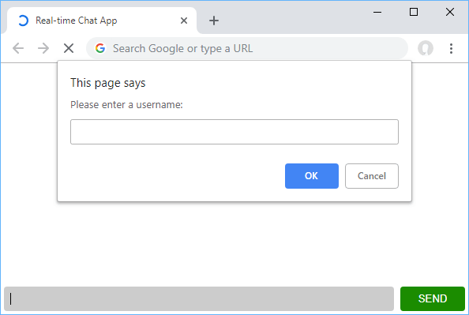
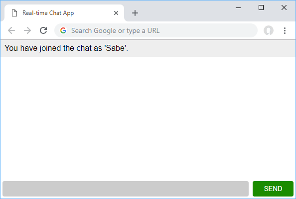
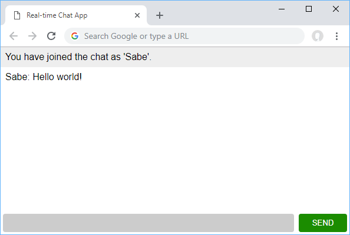

id: 04-socket-io
summary: Socket.io Introduction
categories: WebSockets
status: Published
authors: Hakam
Feedback Link: mailto:hakam.abdelqader

# WebSockets and Socket.io

<!-- ------------------------ -->
## Setting up Express 
Duration: 00:02:00

Create a new folder anywhere and initialize npm init and install express

```
$ mkdir socketIo-chatbot
$ cd socketIo-chatbot
$ npm init
$ npm install express --save
```

Now let's create a file for Node to run as our server. Create a file called `server.js` and put this in it:


```js
const express = require('express');
const app = express();

const port = process.env.PORT || 3000;

app.use(express.static(`${__dirname}/public`)); 

app.get("/", function(req, res){
    res.sendFile(__dirname + "/public/index.html")
})

app.listen(port, function(){
    console.log("Listening on *:" + port);
})
```

### Test application running

```
npm start
```

<!-- ------------------------ -->
## Creating index.html 

First create a folder in the root of the project `public` this is where we will put our chatbot

```
mkdir public
```

Let's create `index.html` to serve as the file we get from the server. Place this  inside `public` folder

### HTML

```html
<!DOCTYPEhtml><html>
    <head>
        <title>Real-time Chat App</title>
        <meta name="viewport" content="width=device-width,minimum-scale=1,initial-scale=1">
        <link rel="stylesheet" href="style.css">
    </head>
    <body>
        <ul class="messages"></ul>
        <form>
            <input type="text"class="input"autocomplete="off"autofocus/>
            <button>Send</button>
        </form>
    </body>
    <script src="script.js"></script>
    </html>
```

### Styles 
Create another file name it `style.css`

Here are all the styles you will need:

```css
body {
    margin: 0;
    font-family: sans-serif;
}

form {
    position: fixed;
    bottom: 0;
    left: 0;
    width: 100%;
    display: flex;
    box-sizing: border-box;
    padding: 0.25rem;
}

form input {
    border: 0;
    padding: 0.5rem;
    width: 100%;
    outline: 0;
    margin-right: 0.5rem;
    border-radius: 0.25rem;
    background: #ccc;
}

form button {
    width: 6rem;
    background-color: #1b8c00;
    color: white;
    border: none;
    padding: 0.5rem;
    cursor: pointer;
    border-radius: 0.25rem;
    text-transform: uppercase;
}

form button:hover {
    background-color: #166d01;
}

.messages {
    margin: 0;
    padding: 0;
    margin-bottom: 3rem;
}

.messages li {
    padding: 0.5rem;
}

.messages li:nth-child(odd) {
    background: #eee;
}
```

### JavaScript Client side

Create another file name it `script.js`

JavaScript to interact with the webpage

```js
const form = document.querySelector("form");
const input = document.querySelector(".input");
const messages = document.querySelector(".messages");
const username = prompt("Please enter a username: ", "");

form.addEventListener("submit", function(event) {
    event.preventDefault();

    addMessage(username + ": " + input.value);

    input.value = "";
    return false;
}, false);

addMessage("You have joined the chat as '" + username  + "'.");

function addMessage(message) {
    const li = document.createElement("li");
    li.innerHTML = message;
    messages.appendChild(li);
    window.scrollTo(0, document.body.scrollHeight);
}
```

<!-- ------------------------ -->
#### Summary 

The code here is really simple. The first three assignments are just querying the page for the form, input button, and our messages list. 

The fourth one is the prompt that asks you what username you'd like to use. After that we attach a listener to prevent the form from submitting, add the message we sent by calling the `addMessage` function, then we reset the value of the input so that we can use it for the next message.

The `addMessage` function takes a string as a parameter and uses it to set the contents of a brand new `li` element.

 That new element is then appended to the `messages` list. Finally, we scroll to the bottom of the body so that new messages are always in view.


Now if you were to head on over to `localhost:3000`, your running server should now serve you this file. Upon page load, you should get a prompt asking you to enter your desired username. After that, you should see the join message with your desired username.

### Choose Username


### Entering Chat



### Writing your message



If you see this, you have done everything correctly so far!

<!-- ------------------------ -->
## Setting Up Socket.io on the Server
Duration: 


Let's get started with actually using Socket.io. Install it by running this command:

```
npm install -save socket.io
```

Open your `index.js` and add this to the top:

```js
const http = require("http").createServer(app);
var io = require("socket.io")(http);
```

This line allows us to start using Socket.io on the server. Let's dive straight into all the code we'll need to power this app. Add this to your `index.js`:

```js
io.on("connection", function(socket) {

    socket.on("user_join", function(data) {
        this.username = data;
        socket.broadcast.emit("user_join", data);
    });

    socket.on("chat_message", function(data) {
        data.username = this.username;
        socket.broadcast.emit("chat_message", data);
    });

    socket.on("disconnect", function(data) {
        socket.broadcast.emit("user_leave", this.username);
    });
});
```

What this code is doing is attaching listeners to any event we want to on any incoming socket that successfully connected. In other words, if a socket connection is established, these are the events we want to listen for.

In our case the events we have are `user_join` which sets the username on the socket for later use and then broadcast back that data to alert others that somebody has joined, `chat_message` which attaches the username and then broadcasts to everybody else that a new message was sent, and `disconnect` which also broadcasts to everybody else that somebody has left the chat.

Believe it or not, but that's all the code we need on the server for our chat app to function. Now we can move on the client!

### Our updated `server.js file`

```js
const express = require('express');
const app = express();
var http = require('http').Server(app);
var io = require('socket.io')(http);

const port = process.env.PORT || 3000;

app.use(express.static(path.join(__dirname, 'public'))); 
app.get("/", function(req, res){
    res.sendFile(__dirname + "/public/index.html")
})

app.listen(port, function(){
    console.log("Listening on *:" + port);
})

io.on("connection", function(socket) {

  socket.on("user_join", function(data) {
      this.username = data;
      socket.broadcast.emit("user_join", data);
  });

  socket.on("chat_message", function(data) {
      data.username = this.username;
      socket.broadcast.emit("chat_message", data);
  });

  socket.on("disconnect", function(data) {
      socket.broadcast.emit("user_leave", this.username);
  });
});
```

<!-- ------------------------ -->
## Setting Up Socket.io on the Client

To start using Socket.io on the client, we must import it. For simplicity's sake, we will use a CDN for this. Add this script tag in your `index.html` at the end of the body tag:

```html
<script src="https://cdnjs.cloudflare.com/ajax/libs/socket.io/2.2.0/socket.io.dev.js"></script>

```

Now you can use it, like so:

```js
const socket =io();
```

Now that we have the capabilities to send and receive messages to and from the server, let's incorporate these new powers in our app. Your form listener should now tell the server when you sent a message. Since the server already knows the username, we only need to send the actual message, which we do like this:

```js
socket.emit("chat_message",{
    message: input.value
});
```

Your new form listener should now look like this:

```js
form.addEventListener("submit",function(event){
    event.preventDefault();

    addMessage(username +": "+ input.value);

    socket.emit("chat_message",{
        message: input.value
    });

    input.value ="";
    returnfalse;},false);
```

Now let's add our client-sided listeners for events coming from the server. Again, these are going to be `chat_message`,`user_join`, and `user_leave`:

```js
socket.on("chat_message",function(data){
    addMessage(data.username +": "+ data.message);});

socket.on("user_join",function(data){
    addMessage(data +" just joined the chat!");});

socket.on("user_leave",function(data){
    addMessage(data +" has left the chat.");});
```

In all three of these cases, the only thing we need to do is add a new message with the relevant information. This means adding a new message when a `chat_message` event is received, and then doing the same whenever somebody joins or leaves the chat.

Finally, when we load the page, we need to tell the server, and thus others, that we have joined. We do this by emitting a `user_join` message with the username we chose for ourselves:

```js
socket.emit("user_join", username);
```

Put this all together, and your finalized client-sided JavaScript should look something like this:

```js
const form = document.querySelector("form");
const input = document.querySelector(".input");
const messages = document.querySelector(".messages");
const username = prompt("Please enter a nickname: ", "");
const socket = io();

form.addEventListener("submit", function(event) {
    event.preventDefault();

    addMessage(username + ": " + input.value);

    socket.emit("chat_message", {
        message: input.value
    });

    input.value = "";
    return false;
}, false);

socket.on("chat_message", function(data) {
    addMessage(data.username + ": " + data.message);
});

socket.on("user_join", function(data) {
    addMessage(data + " just joined the chat!");
});

socket.on("user_leave", function(data) {
    addMessage(data + " has left the chat.");
});

addMessage("You have joined the chat as '" + username  + "'.");
socket.emit("user_join", username);

function addMessage(message) {
    const li = document.createElement("li");
    li.innerHTML = message;
    messages.appendChild(li);
    window.scrollTo(0, document.body.scrollHeight);
}
```

<!-- ------------------------ -->
## Conclusion


Putting everything together your final `server.js` should look like this:

```js
import { Server } from 'socket.io';
import express from 'express';
import { createServer } from 'http';

const app = express();
const http = createServer();
const io = new Server(server);
const port = process.env.PORT || 3000;

app.get("/", function(req, res) {
    res.sendFile(__dirname + "/index.html");
});

io.on("connection", function(socket) {

    socket.on("user_join", function(data) {
        this.username = data;
        socket.broadcast.emit("user_join", data);
    });

    socket.on("chat_message", function(data) {
        data.username = this.username;
        socket.broadcast.emit("chat_message", data);
    });

    socket.on("disconnect", function(data) {
        socket.broadcast.emit("user_leave", this.username);
    });
});

http.listen(port, function() {
    console.log("Listening on *:" + port);
});
```

And your final `script.js` like this:

```js
const form = document.querySelector("form");
            const input = document.querySelector(".input");
            const messages = document.querySelector(".messages");
            const username = prompt("Please enter a nickname: ", "");
            const socket = io();

            form.addEventListener("submit", function(event) {
                event.preventDefault();

                addMessage(username + ": " + input.value);

                socket.emit("chat_message", {
                    message: input.value
                });

                input.value = "";
                return false;
            }, false);

            socket.on("chat_message", function(data) {
                addMessage(data.username + ": " + data.message);
            });

            socket.on("user_join", function(data) {
                addMessage(data + " just joined the chat!");
            });

            socket.on("user_leave", function(data) {
                addMessage(data + " has left the chat.");
            });

            addMessage("You have joined the chat as '" + username  + "'.");
            socket.emit("user_join", username);

            function addMessage(message) {
                const li = document.createElement("li");
                li.innerHTML = message;
                messages.appendChild(li);
                window.scrollTo(0, document.body.scrollHeight);
            }
```

Make sure to restart your server to use your new code. 

Once you do, you should be able to open multiple tabs on your browser, give each tab a unique name, chat across all of them in real-time, leave and join and see the messages on the other clients, just as you would expect.

While this is a simple example of using Socket.io, it is very powerful and supports many more features than the ones shown here. 