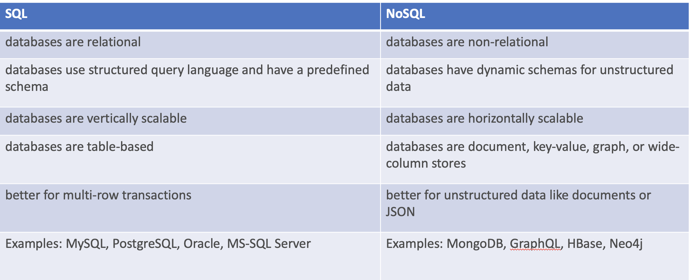
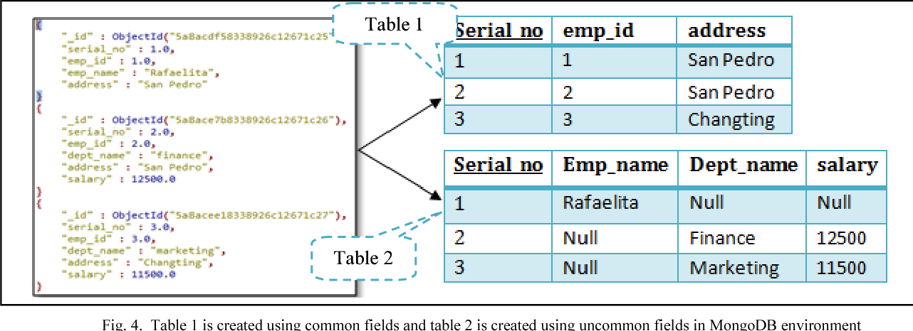
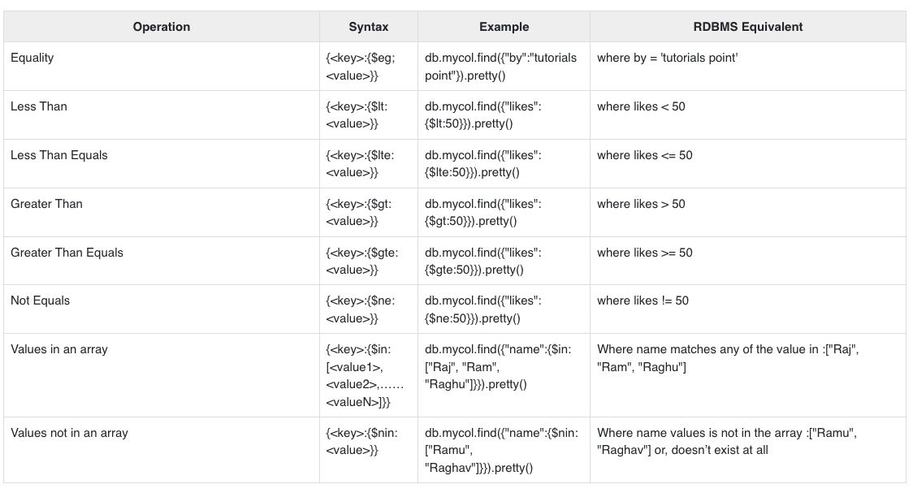

id: 05-mongoDB
summary: Understand the CRUD meti
categories: MongoDB
status: Published
authors: Hakam Abdelqader
Feedback Link: mailto:hakam.abdelqader@ibm.com

# MongoDB Introduction

<!-- ------------------------ -->
## Introduction 

MongoDB is an open-source, cross-platform, and distributed document-based database designed for ease of application development and scaling. 

It is developed by MongoDB Inc. with a NoSQL architecture in mind by which the storage and retrieval of data in the MongoDB are not in the form of tables.


### Key Features
- Support large numbers of concurrent users (tens of thousands, perhaps millions)
- Deliver highly responsive experiences to a globally distributed base of users
- Be always available – no downtime
- Handle semi- and unstructured data 
- Rapidly adapt to changing requirements with frequent updates and new features 
- Easy to scale up or down as per the requirement since it is a document-based database 
- Provides tools to manage MongoDB databases

### Difference between SQL and NoSQL



## Translate SQL schema and NoSQL



<!-- ------------------------ -->
## Create Database and collection
```sh
# Creating a Users database
> use Users

# To validate that database creation
> show databases

# creating a new collection inside the Users database
> db.createCollection('user_info')

# To validate that collections creation
> show collections

# Delete a collection inside the Users database
> db.user_info.drop()

# To validate that collections deletion
> show collections
```

## Create documents

```sh

# Adding a document in a collection
> db.user_info.insertOne({
	_id: 1,
	givename: "Hakam",
	surname: "Adelqader",
	email: "hakam.abdelqader@ibm.com",
	office_location: "Dubai",
	network_id: 12345,
	address: "Building 1, Work address"
})

# Adding a user with two address info instead of only one
> db.user_info.insertOne({
	_id: 1,
	givename: "Hakam",
	surname: "Adelqader",
	email: "hakam.abdelqader@ibm.com",
	office_location: "Dubai",
	network_id: 12345,
	address: { work: "Building 1, Work address", home: "Building 1, Home address"}
})
```

### Insert Many documents at once

```sh

# Adding a new users in one call
> db.user_info.insertMany([
	{
    	_id: 1,
    	givename: "Hakam",
        surname: "Adelqader",
        email: "hakam.abdelqader@ibm.com",
        office_location: "Dubai",
        network_id: 12345,
        address: "Building 1, Work address"
	},
  {
    	_id: 2,
        givename: "Ahmed",
        surname: "Yahya",
        email: "ahmed.yahya@ibm.com",
        office_location: "Cairo",
        network_id: 54321,
        address: "Building 2, Work address"
	}]
  )
```

## Read collection

```sh
# Listing all the documents in collection
> db.user_info.find({})

# Listing a specific document with an _id
> db.user_info.find({_id: 1})

# Listing all the documents with matching field and value
> db.user_info.find({email: 'hakam.abdelqader@ibm.com'})

# To limit a results length
> db.user_info.find({}).limit(1)

# To display a documnet in a proper JSON format
> db.user_info.find({}).limit(1).pretty()
```

## Update collection

```sh

# To update a field value inside document
> db.user_info.updateOne(
	{
    	_id: 1
    },
    {
    	$set: {
        	office_location: 'Khobar'
            }
    })
    
# To update all record containing a matching field and value
> db.user_info.updateMany(
	{ 
    	givename: "Hakam"
    },
    {
    	$set: { 
        	office_location: 'Khobar'
            }
    })
```

### Replace the document

```sh
# To replace all fields in a document and assign new ones
> db.user_info.replaceOne(
	{
    	_id: 1
    },
    {
        givename: "Hakam",
        surname: "Adelqader",
        email: "hakam.abdelqader@ibm.com",
        home_location: "Dubai",
        office_location: "Dubai",
        network_id: 12345,
        address: "Building 1, Work address"
     })
```

## Delete collection

```sh
# To delete a documnet using the _id
> db.user_info.deleteOne(
	{
    	_id: 1
    }
)

# To delete all documnets with matching field and value
> db.user_info.deleteMany(
	{
    	givename: "Hakam"
    }
)
```

<!-- ------------------------ -->


## RDBMS Where Clause Equivalents in MongoDB
To query the document on the basis of some condition, you can use following operations.



### By example

Create a new database with the followning data

```sh
>use employee

db.createCollection("empDetails")
```

InsertMany for the examples

```sh
db.empDetails.insertMany(
	[
		{
			First_Name: "Radhika",
			Last_Name: "Sharma",
			Age: "26",
			e_mail: "radhika_sharma.123@gmail.com",
			phone: "9000012345"
		},
		{
			First_Name: "Rachel",
			Last_Name: "Christopher",
			Age: "27",
			e_mail: "Rachel_Christopher.123@gmail.com",
			phone: "9000054321"
		},
		{
			First_Name: "Fathima",
			Last_Name: "Sheik",
			Age: "24",
			e_mail: "Fathima_Sheik.123@gmail.com",
			phone: "9000054321"
		}
	]
)


```

## AND and OR statements

### AND in MongoDB

**Syntax**
To query documents based on the AND condition, you need to use $and keyword. Following is the basic syntax of AND −

```sh
db.mycol.find({ $and: [ {<key1>:<value1>}, { <key2>:<value2>} ] })

```

For the above given example, equivalent where clause will be ' where by = 'tutorials point' AND title = 'MongoDB Overview' '. You can pass any number of key, value pairs in find clause.

### OR in MongoDB

**Syntax**
To query documents based on the OR condition, you need to use $or keyword. Following is the basic syntax of OR −

```sh
db.COLLECTION_NAME.find(
   {
      $or: [
         {key1: value1}, {key2:value2}
      ]
   }
).pretty()

```

### Using AND and OR Together

**Example**

The following example will show the documents that have likes greater than 10 and whose title is either 'MongoDB Overview' or by is 'tutorials point'. Equivalent SQL where clause is 'where likes>10 AND (by = 'tutorials point' OR title = 'MongoDB Overview')'

```sh
db.empDetails.find({"Age": {$gt:26}, $or: [{"First_Name": "Fathima"},
   {"First_Name": "Rachel"}]}).pretty()
{
			First_Name: "Rachel",
			Last_Name: "Christopher",
			Age: "27",
			e_mail: "Rachel_Christopher.123@gmail.com",
			phone: "9000054321"
}
```

## NOR in MongoDB

**Syntax**

To query documents based on the NOT condition, you need to use $not keyword. Following is the basic syntax of NOT −


```sh
>db.COLLECTION_NAME.find(
	{
		$nor: [
			{key1: value1}, {key2:value2}
		]
	}
)

```
### Example


Following example will retrieve the document(s) whose first name is not "Radhika" and last name is not "Christopher"

```sh
> db.empDetails.find(
	{
		$nor:[
			40
			{"First_Name": "Radhika"},
			{"Last_Name": "Christopher"}
		]
	}
).pretty()
{
	"_id" : ObjectId("5dd631f270fb13eec3963bef"),
	"First_Name" : "Fathima",
	"Last_Name" : "Sheik",
	"Age" : "24",
	"e_mail" : "Fathima_Sheik.123@gmail.com",
	"phone" : "9000054321"
}
```

## NOT in MongoDB

**Syntax**

To query documents based on the NOT condition, you need to use $not keyword following is the basic syntax of NOT 


```sh
>db.COLLECTION_NAME.find(
	{
		$NOT: [
			{key1: value1}, {key2:value2}
		]
	}
).pretty()
```

**Example**

Following example will retrieve the document(s) whose age is not greater than 25

```sh
 db.empDetails.find( { "Age": { $not: { $gt: "25" } } } )
{
	"_id" : ObjectId("5dd6636870fb13eec3963bf7"),
	"First_Name" : "Fathima",
	"Last_Name" : "Sheik",
	"Age" : "24",
	"e_mail" : "Fathima_Sheik.123@gmail.com",
	"phone" : "9000054321"
}
```