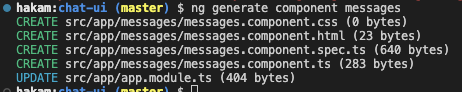

id: 06-angular
summary: Angular Introduction
categories: angular-js
status: Published
authors: Hakam Abdelqader
Feedback Link: mailto:hakam.abdelqader@ibm.com

# Angular Complete Crash Course

<!-- ------------------------ -->
## Introduction 
Duration: 00:10:00

In this codelab, you'll build a chatbot app with Angular. The completed app will feature the ability to create a watson assistant chatbot and using socketio based on the user input the watson assistant will reply with the correct response

You'll build everything with Angular using Angular's powerful tooling and great browser integration.

This is the app you'll be building today

### What you'll learn

-   Difference between Angular and React
-   How to use the Angular CLI to scaffold a new project.
-   How to use Angular components to build a user interface.
-   How to share data in components and other parts of an app.
-   How to use event handlers in Angular.

<!-- ------------------------ -->
## Angular vs React 

### Angular

Angular is a structural framework for developing dynamic web apps developed by **Google**. It allows developers to use HTML as a template language and allows HTML’s syntax to express the application’s components briefly and clearly.

It is a fully featured JavaScript framework that helps developing dynamic, single page web apps. It also supports the (MVC) programming structure.

### React

React is a JavaScript library developed by **Facebook** which allows you to build UI components. It facilitates the creation of interactive User Interfaces. It also makes the code easier to understand and launch. React Java Script framework uses server-side rendering to provide a flexible, performance-oriented solution.

<!-- ------------------------ -->
## Framework vs Library


* Angular and React have many similarities and many differences. One of them is that **Angular** is a full-fledged MVC framework and **React** is merely a JavaScript Library.
* **Angular** is considered a framework because it offers strong opinions as to how your application should be structured.
* **React**, on the other hand, gives you much more freedom. It only provides the “view” . Due to this, you can choose any of your own libraries as you see fit. You will end up using many independent, fast-moving libraries. Because of this, you will need to take care of the corresponding updates and migrations by yourself.
  
## DOM vs Virtual DOM

* DOM stands for *Document Object Model* and is an abstraction of a structured text. For web developers, this text is an HTML code, and the DOM is simply called *HTML DOM*.*Elements* of HTML become *nodes* in the DOM. So, while HTML is a text, the DOM is an in-memory representation of this text.
* Angular opted to use a **regular DOM. **This will update the entire tree structure of HTML tags.
* First of all — the ***Virtual DOM*** was not invented by React, but React uses it and provides it for free.
* The *Virtual DOM* is an abstraction of the HTML DOM. It is lightweight and detached from the browser-specific implementation details. Since the DOM itself was already an abstraction, the virtual DOM is, in fact, an abstraction of an abstraction.


## One-way VS Two-way Binding


* Angular uses **two-way binding.** For example, if you change the UI element (a user input) in Angular, then the corresponding model state changes as well. Additionally, if you change the model state, then the UI element changes — hence, **two-way data binding**.
* React only has **one-way binding**. First, the model state is updated, and then it renders the change in the UI element. However, if you change the UI element, the model state **DOES NOT** change. You must figure that out for yourself. Some common ways are through **callbacks** or **state management** libraries.

<!-- ------------------------ -->
## History for the Framework and Library

### History of React JS

React was created by Jordan Walke in 2011 and Open sourced it in May 2013
Facebook and Instagram released React 16.0 on September 2017

The latest version React Fiber was released with React 16 in September 2017. React Fiber is an ongoing implementation of Reac’ts Core Algorithm.

### History of Angular

AngularJS was released in 2010 by Google.

- 2.0 version which also called Angular 2 or just Angular was released in September 2016
- 4.0 version was released in March 2017
- 5.0 version was released in Nov 2017


<!-- ------------------------ -->
## Components

#### Angular
The Angular is a **framework** based on three layers, Models, Views, and Controllers. **MVC**

It comes with a complex and fixed structure. With Angular, the developers break down the codes into separate files, which makes it easier for them to re-use the templates and codes in other projects.


#### React
The React is a **library** that doesn’t have a fixed format to write codes in. The code written using the React library is well structured and readable. 

The use of component trees allows the code to be logically structured. The library also has functional programming, which makes the component declarations declarative.


<!-- ------------------------ -->
## Performance and Testing

###  Performance
The grand barrier to performance with a JavaScript framework/library-associated website is its DOM (virtual or real).

Angular’s utilization of a Regular DOM causes potential performance issues, especially with many UI elements and web page information.

In short, React’s Virtual DOM is regarded as considerably faster than Angular’s Regular DOM due to more efficient state changing and Virtual Tree updating.

### Testing

#### Angular
However, Angular takes advantage of a testing framework called **Jasmine**. Regardless, many developers find the output rather bloated and difficult to read.

#### React
**Jest**, used by Facebook to test React code, is included in every React project and requires absolutely zero configuration to use out-of-the-box.

Additionally, it includes a powerful mocking library for prototype development.


<!-- ------------------------ -->
## Key Difference Between React and Angular


### Key Features of Angular
-----------------------


* Built-in support for AJAX, HTTP, and Observables are just a few of Angular’s highlights. There is widespread support in the community.

* In line with current technologies

* Typescript is time-saving.

* Coding that is more clear and concise

* Error-handling support has been improved.

* Angular CLI allows for seamless updates.

* Validation and forms

* Local CSS / shadow DOM

* Separation of User Interface and Business Logic


### Key Features of React
---------------------


* React’s key features include the ability to use third-party libraries.

* Time-Saving

* Composability and Simplicity

* Facebook is fully behind you.

* Improved user experience and lightning-fast speed.

* More rapid development

* One-directional data binding provides code stability.

* Components in React


### Key Difference of Angular vs React
----------------------------------

* Purpose

* Data Binding

* Language

* UI Components

* Dependency Injection

* DOM
* 

<!-- ------------------------ -->
## Summary differences


<table><tbody><tr><td width="301"><strong>Angular</strong></td><td width="301"><strong>React</strong></td></tr><tr><td width="301">Offers a complete framework to design large enterprise, progressive and single-page applications</td><td width="301">Used as a JavaScript library to render individual UI components</td></tr><tr><td width="700">Provides advanced features like dependency injection, differential loading, lazy loading</td><td width="700">Supports only lazy loading</td></tr><tr><td width="301">Angular is based on TypeScript</td><td width="301">React is based on JavaScript</td></tr><tr><td width="301">Follows MVC architecture</td><td width="301">Based on Virtual DOM</td></tr><tr><td width="301">It can be thought of as an extension of HTML attributes</td><td width="301">Developers can write HTML code inside a script that React renders as a component</td></tr><tr><td width="301">Provides debugging and testing functionality as a tool</td><td width="301">React doesn’t provide any in-built tool, so we have to use various tools for different types of testing</td></tr><tr><td width="301">Greater learning curve but comparatively easy to setup</td><td width="301">An easier learning curve, however, takes time to setup</td></tr><tr><td width="301">Two-way binding wherein the model state changes as the data changes</td><td width="301">One-way data binding, wherein the UI elements can be changed only when the model state changes</td></tr><tr><td width="301">We cannot add a JavaScript library to the source code</td><td width="301">Allows to add JavaScript library to the source code</td></tr><tr><td width="301">Angular CLI provides a host of tools for development and seamless updates</td><td width="301">Since React is only for UI, it doesn’t have a CLI</td></tr></tbody></table>

## When To Use React vs. Angular?

To make optimum use of these frameworks, you need to determine your needs from the project in hand. 

- If you are looking for higher productivity, a clean coding environment, and ready-to-use solutions, choose Angular.

- However, if you are aiming for a highly customized web application, utilize the flexibility offered by React.

### Learning Curves
The objective learning curves for both React and Angular can be understood in terms of their inherent framework-level and library-level features that create distinct complexity levels.

Angular is a full-featured model-view -controller (MVC) framework whereas React is an open-source JavaScript library.

The learning curve for Angular is relatively high with React possessing a low learning curve that is initially difficult to grasp.

<!-- ------------------------ -->
## Angular Introduction 

These tutorials will help you learn the essentials of the latest version of Angular, starting from the basics to the advanced level. 

### Environment Setup

### New day, new folder

To start off with angular we need to create an empty folder that will host our chatbot and the assets we will create.

```sh
mkdir Day-4-Angular
```

### Install the Angular CLI

Once all of your dependencies are configured, you can install the Angular CLI from a command-line window on your computer:

```sh
npm install -g @angular/cli
```

To confirm that your configuration is correct, run this command from your computer's command line:

```
ng version
```
If the command works successfully, you'll find a message similar to the screenshot below.


```sh
# Getting help in Angular CLI
$ ng help
```

### Get Started with Angular Bootstrap code

The code for this codelab contains the intermediate steps. To get started, follow the steps below:


```sh
# Creating angular application
# ng new <project-name> --skip-install
$ ng new chat-ui
```
Angular will ask you if you want to include routing skip that as our chatbot does not include multiple pages

```sh
? Would you like to add Angular routing? (y/N) N
```

Next Angular will ask what type of styling you would use select `CSS`. 

```sh
❯ CSS 
  SCSS   [ https://sass-lang.com/documentation/syntax#scss                ] 
  Sass   [ https://sass-lang.com/documentation/syntax#the-indented-syntax ] 
  Less   [ http://lesscss.org                                             ] 
```

### Check your project

Angular will now install the node_modules needed for the application and create the folder structure and creates all the files you need to get started. Once the installation is done run the command

```sh
$ cd chat-ui
$ ng serve --open 
```


The `ng serve` command keep watching source files, so if you make any changes in any file of the project, it will rebuild it and refresh the browser automatically to reflect the changes.

To stop the automatic build process, press `Ctrl + c / CMD + c` in the terminal of VS Code.

Thus, you can create a workspace and an initial Angular project and run it using VS Code.

### To build for production

```sh
# to build application 
$ ng build

# create dist folder which will go for production
```

<!-- ------------------------ -->
## Folder structure

### Configuration files
- angular.json -> Angular
- package.json -> Node
- tsconfig.json -> TypeScript
- tslint.json -> Linting

### Files in dist folder (after running ng build cmd)
- runtime.js -> This is for webpack runtime
- polyfill.js -> Helps to run new ES version javascript in old browser which does not support them
- vendor.js -> Actual project code (component, modules, model)
- main.js -> Points first module
- style.js -> all css code 


Angular is a SPA framework, and a view is made of one or more component. An Angular component represents a portion of a view.

Generally, an interactive web page is made of HTML, CSS, and JavaScript. Angular component is no different.

Angular Component = HTML Template + Component Class + Component Metadata


### HTML Template
HTML template is nothing but a regular HTML code with additional Angular specific syntax to communicate with the component class.

### Class
Essentially, a component class is a TypeScript class that includes properties and methods. Properties store data and methods include the logic for the component. Eventually, this class will be compiled into JavaScript.

Positive
: TypeScript is an open-source, object-oriented language developed and maintained by Microsoft. It is a typed superset of JavaScript that compiles to plain JavaScript.

### Metadata
Metadata is some extra data for a component used by Angular API to execute the component, such as the location of HTML and CSS files of the component, selector, providers, etc.


<!-- ------------------------ -->
## Create your first component

Components are the core building blocks for Angular apps. Components are like lego pieces they are small segments of code that make up entire application or if we are building legos the whole lego model

Components have 3 main aspects:

-   An HTML file for the template.
-   A CSS file for the styles.
-   A TypeScript file for the behavior of the app.


The first component you're going to update is `AppComponent`.

1.  Open `app.component.html` in your code editor; this is the template file for the `AppComponent`.
2.  Delete all the code in this file and replace it with this:

```html
<main>
  <header>Chat bot</header>
  <section>
  </section>
</main>

```


## Generate Component

You can create files for a component manually or using the Angular CLI command. Angular CLI reduces the development time. So, let's use Angular CLI to create a new component.

Use the following CLI command to generate a component.

```sh
ng generate component messages
```


