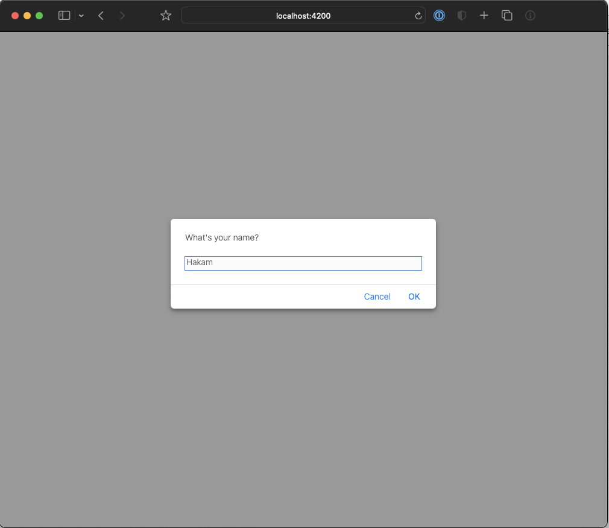

id: 07-mean-chatbot
summary: Summary of lab
categories: Angular, nodejs, express, mongodb
status: Published
authors: Hakam Abdelqader
Feedback Link: mailto:hakam.abdelqader@ibm.com

# Angular Chatbot + NodeJs + Express + mongodb

<!-- ------------------------ -->
## Introduction 
Duration: hh:mm:ss

I’ll take you through building a chat application with Angular.
I will be using the conceps we used in **NodeJs** and **Express**.

Finally we will be using this application to connect to Watson assitant and save the chatbot logs to the database.

Here’s how the final application will look like:

### Ask for User's Name


### Final Output


<!-- ------------------------ -->
## Setup project 

To begin creating the application, type the following lines into your terminal.

This will setup the project folder and install the dependencies need for this project.

```sh
$ mkdir angular-chatbot
$ cd  angular-chatbot
$ npm init -y
$ npm install express dotenv body-parser cors nodemon concurrently ibm-watson
```

### Auto reload server scripts

We have installed a packed called `nodemon`, so that any changes made in the `index.js` file will be automatically detected after saving the file, ofcourse. 

To use `nodemon` we need to call the script inside the `package.json`. Edit the `"scripts"` section to have the `"start"` to be loaded by `nodemon` package:

```json
 "scripts": {
    "test": "echo \"Error: no test specified\" && exit 1",
    "start": "nodemon index.js"
  },
```


<!-- ------------------------ -->
## Creating NodeJs Server 

Create a new `index.js` file in your project directory and use the following code to create a typical express application:

### `index.js` express application

```js
const express = require("express");
const bodyParser = require("body-parser");

//Reads .env file created at the root of the project
require("dotenv").config(); 

const app = express();

//Initialize body-parser
app.use(bodyParser.json());
app.use(bodyParser.urlencoded({extended: true}));

//setup http-server to listen on port 5001
const port = process.env.PORT || 5001
app.listen(port, () => 
  console.log(`Server running on port ${port}`)
)

// Add logic below

```

The above code is the start to our server **Express + NodeJS** application. **NodeJS** will act as our server that will communicate to Watson assistant and **MongoDB** database

<!-- ------------------------ -->
## Adding Watson to server

Add watson assistant required packages at the top of the file to keep all our require modules in one place

```js
const AssistantV2 = require("ibm-watson/assistant/v2")
const { IamAuthenticator } = require("ibm-watson/auth")
```

After you have imported the required modules for Watson assistant create assitant object and initialization as per Watson API

```js
// Add to the end of the file

const assistant = new AssistantV2({
  version: process.env.VERSION, // Replace '{version}' 
  authenticator: new IamAuthenticator({
    apikey: process.env.APIKEY, // Replace '{apikey}' 
  }),
  serviceUrl: process.env.WATSON_URL, // Replace '{url}' 
});
```
- **Get** will get the session Id for the current chat:
  
```js
// Get route for Session ID
app.get('/createSession', (req, res) => {
  // call assistant to create session
  assistant.createSession({assistantId: process.env.ASSISTANT_ID})
           .then(session => res.json(session.result.session_id)) 
           .catch(err => res.json(err))
})
```

- **Post** will send the message to watson to reply back to us:
  
```js
//Post route to send messages to Watson Assistant 
app.post("/ask", async (req, res) =>{ 
  
  const { session_id, text } = req.body 

  const message = {
    assistantId: process.env.ASSISTANT_ID,
    sessionId: session_id, 
    input: {
      message_type: 'text',
      text: text
      }
    }
  
    assistant.message(message)
             .then(response => res.json(response.result))
             .catch(err => res.json(err))
})
```

### Final `index.js` file

```js
const express = require("express");
const bodyParser = require("body-parser");
const AssistantV2 = require("ibm-watson/assistant/v2")
const { IamAuthenticator } = require("ibm-watson/auth")

//Reads .env file created at the root of the project
require("dotenv").config(); 

const app = express();

//Initialize body-parser
app.use(bodyParser.json());
app.use(bodyParser.urlencoded({extended: true}));

//setup http-server to listen on port 5001
const port = process.env.PORT || 5001
app.listen(port, () => 
  console.log(`Server running on port ${port}`)
)

// Get route for Session ID
app.get('/createSession', (req, res) => {
  // call assistant to create session
  assistant.createSession({assistantId: process.env.ASSISTANT_ID})
           .then(session => res.json(session.result.session_id)) 
           .catch(err => res.json(err))
})

// Post route to send messages to Watson Assistant 
app.post("/ask", async (req, res) =>{ 
  
  const { session_id, text } = req.body 

  const message = {
    assistantId: process.env.ASSISTANT_ID,
    sessionId: session_id, 
    input: {
      message_type: 'text',
      text: text
      }
    }
  
    assistant.message(message)
             .then(response => res.json(response.result))
             .catch(err => res.json(err))
})
```

<!-- ------------------------ -->
## Angular Setup


### Install the Angular CLI

Once all of your dependencies are configured, you can install the Angular CLI from a command-line window on your computer:

```sh
npm install -g @angular/cli
```

To confirm that your configuration is correct, run this command from your computer's command line:

```
ng version
```
If the command works successfully, you'll find a message similar to the screenshot below.


```sh
# Getting help in Angular CLI
$ ng help
```

### Get Started with Angular Bootstrap code

The code for this codelab contains the intermediate steps. To get started, follow the steps below:


```sh
# Creating angular application
# ng new <project-name> --skip-install
$ ng new chat-ui
```
Angular will ask you if you want to include routing skip that as our chatbot does not include multiple pages

```sh
? Would you like to add Angular routing? (y/N) N
```

Next Angular will ask what type of styling you would use select `CSS`. 

```sh
❯ CSS 
  SCSS   [ https://sass-lang.com/documentation/syntax#scss                ] 
  Sass   [ https://sass-lang.com/documentation/syntax#the-indented-syntax ] 
  Less   [ http://lesscss.org                                             ] 
```

### Check your project

Angular will now install the node_modules needed for the application and create the folder structure and creates all the files you need to get started. Once the installation is done run the command

```sh
$ cd chat-ui
$ ng serve --open 
```


The `ng serve` command keep watching source files, so if you make any changes in any file of the project, it will rebuild it and refresh the browser automatically to reflect the changes.

To stop the automatic build process, press `Ctrl + c / CMD + c` in the terminal of VS Code.

Thus, you can create a workspace and an initial Angular project and run it using VS Code.

### To build for production


```sh
# to build application 
$ ng build
# create dist folder which will go for production
```

<!-- ------------------------ -->
## Watch Server + Client 

To watch changes for both the Angular project and the Nodejs project we can edit our `package.json` script in the root directory and use the `concurrently` package we installed earlier

### `package.json`

Edit the `scripts` section in the `package.json` to the following:

```json
 "scripts": {
    "test": "echo \"Error: no test specified\" && exit 1",
    "dev": "concurrently \"nodemon index.js\" \"cd ./chat-ui && npm start\""
  },
```

Positive
: I have renamed the `start` to `dev` to differentiate between watching the project and actually starting up the application. You can keep `start` if you would like. However, in real application `start` is meant to start the nodeJs application and build the angular project to commit the changes.  

<!-- ------------------------ -->
## Understanding Folder Structure

The main focus on the application will be in `src/app` folder, where all the actual logic is going to go. It looks something like this:


### Main files to watch 
- app.module.ts
- app.component.ts
- component1
     component1.component.css
     component1.component.html
     component1.component.ts
     
In actuality each of the components files is listed in a folder then broken down into their .html and .css counterparts. But typically these files are enough to understand whrere we will get started on this project.

```
├── src
│   ├── app
│   │   
│   ├── app.component.css   
│   │   
│   ├── app.component.html   
│   │   
│   ├── app.component.ts   
│   │   
│   ├── app.module.ts  
│   │  
│   ├── component1
│   │   │ 
│   │   ├── component1.component.css
│   │   │ 
│   │   ├── component1.component.html
│   │   │ 
│   │   ├── component1.component.ts
```

### TL;DR

For your reference however here is the explanation of ever file and folder created

- **e2e** - e2e stands for "end to end", this is the place where we can write the end to end test.

- **node_modules** - In this, you can find all the library and packages which are used in the app.

- **src** - This file is very important for development purposes. we are mostly working with this file. this file contains many file like components, assets, environment.

  - **app** folder
    Which contains all the “modules” and “components” of your angular application. Every application has at least one “module” and one “component”. Each component contants the testing file that ends with ".spec.ts" and the rest we know *.componet.html, *.componet.ts, *.componet.css

  - **assets** folder
    In the asset folder, we can store static assets of our application for example images, icons, and so many things.

  - **environment** folder
    In the environment, we can store configuration settings for different environments. Basically, this folder contains two files: 
    - (1)e**nvironment.prod.ts** - this file for the production environment.
    - (2)**environment.ts** - this file for the development environment.
    - 
- **favicon.ico** - This is an icon file that displays on the browser tab.

- **index.html** - This is only one index file in the angular project. all the component's view dynamically renders with this file. 

- **main.ts**- This file is a TypeScript file. It is the starting point of angular application. here we can execute bootstrap to our main module.

- **pollyfills.ts** -  this file imports all scripts required for running an Angular app.

- **style.css** - This file is used for writing global CSS for the angular app.

- **test.ts** - this file is used for setting the testing environment in our app.

- **angular-cli.json** -  This file contains the standard configuration file of your application

- **editor config** -  this file is used when you are working in a team environment. So make sure all the programmers have the same configuration.

- **gitignore** - this file is used for exporting files and folders to/from your git repository.

- **karma.conf.js** - This file is used for test cases for the app.

- **pacakge.json** - this file contains all packages, dependencies, dev dependencies, name of the project, etc.


- **tsconfig.json** - this file has a bunch of settings for your TypeScript compiler, so your typescript compiler looks at the setting and based on these settings, compiles your typescript code into javascript, so that browser can understand.

[Reference](https://hackernoon.com/folder-structure-of-angular-applications-9a2234hp)

<!-- ------------------------ -->
## app.component.ts 

Angular creates an `index.html` which references our selector in the `app.component.ts`

```html
<!doctype html>
<html lang="en">
<head>
  <meta charset="utf-8">
  <title>ChatUi</title>
  <base href="/">
  <meta name="viewport" content="width=device-width, initial-scale=1">
  <link rel="icon" type="image/x-icon" href="favicon.ico">
</head>
<body>
  <app-root></app-root> <!-- app.component.ts selector -->
</body>
</html>

``` 
### app.component.ts